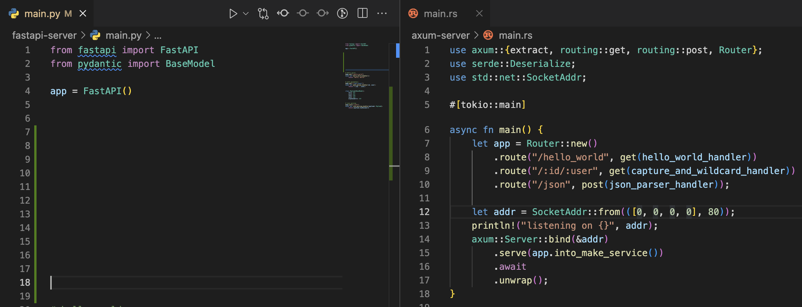
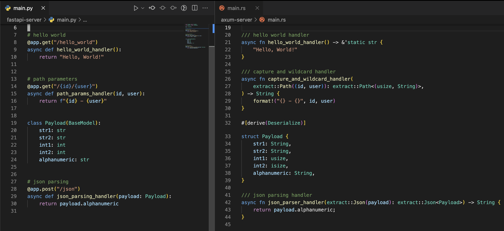
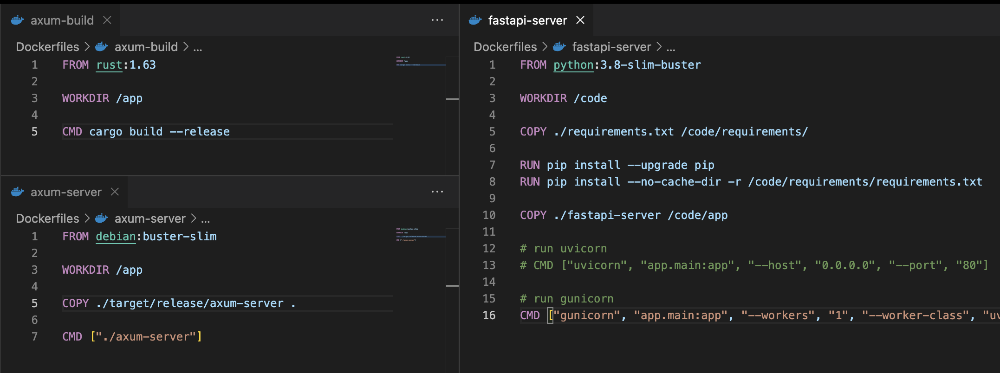
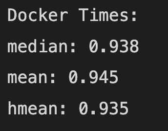

# FastAPI vs axum
A project to assess the differences between two web frameworks in Python (FastAPI) and Rust (axum). The frameworks will be assessed using three criteria: code complexity, deployment, and speed.

## Code Complexity

Rust's base app logic is more complex than FastAPI's `App` object and decorator pattern. 

_Note: this is a deliberate design choice of `axum` to have a "a macro free API" compared to other Rust frameworks with a similar code pattern/feel as decorators in Python_


<br>
<br>

In this case, the handlers and data models (pydantic and serde respectively) are virtually the same code footprint:


<br>
<br>

## Deployment

### Dependencies
Python (FastAPI) requires dependency management at runtime. In this case, `poetry` was used and the `requirements.txt` file is made via `poetry` to ensure pinned dependencies for the runtime environment:

```shell
poetry export --without-hashes > requirements.txt
```

For Rust, `cargo` and the `Cargo.toml` manage all the dependencies. Since Rust is compiled there is no runtime dependencies to pin or manage.

The differences are really a tradeoff, Rust has two Dockerfiles and Python has one Dockerfile, but requires a method to install pinned dependencies (for a consistent environment).


<br>
<br>

### Image Size

Rust requires a large upfront image for compilation (this could most likely be smaller, but compilation image size is not a concern). Python's image size can vary depending on user configuration, but remains ~2x larger than the Rust server image:


<br>
<br>

Overall for deployment, FastAPI takes more configuration: various base images (buster, slim-buster, etc.), two possible workers (gunicorn and uvicorn), and a dependency management solution. Being a compiled language, Rust avoids some of these tasks/configuration.

## Speed

Docker Desktop settings used:

<br>
<br>

Results for axum times / fastapi times:


<br>
<br>

Visualized results by threads and number of requests (axum: red, fastapi: blue):

<br>
<br>

Overall, `axum` is faster in my very limited tests by ~6% than `FastAPI`. These results show that this is a negligible consideration for choosing between the frameworks. However, other online sources have shown `axum` to be one of the fastest servers available and a magnitude (~5x) faster than `FastAPI`. The CPU usage during the tests suggests the client is the bottleneck here for the benchmarks. To improve upon these results, server-side timings would need to be collected.

## Conclusion 

Both frameworks offer a nice interface for creating and deploying micro-services/servers quickly. `FastAPI` is a mature and very pythonic framework. However if given a blank slate, I would choose `axum` and Rust for new project for these reasons:
- the memory and type safety of Rust
- similar code complexity
- smaller images (faster deployment and scaling)
- faster processing

_Note: the release of `Pydantic` 2.0 may lead to speedups for the `FastAPI`+`Pydantic` stack._